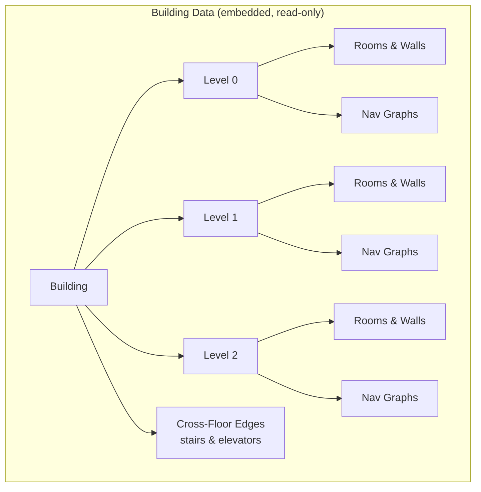

# Building Data API

Read-only endpoints for building metadata, floor plans, and cross-floor connections.



## Get Building Metadata

```
GET /api/building
```

Returns building name and available floor levels.

```bash
curl http://localhost:9090/api/building
```

```json
{
  "name": "A-Building (LTU)",
  "levels": [
    {"id": "level0", "label": "Floor 0"},
    {"id": "level1", "label": "Floor 1"},
    {"id": "level2", "label": "Floor 2"}
  ]
}
```

## Get Floor Data

```
GET /api/building/floors/{level}
```

Returns full floor plan data: page dimensions, rooms with polygons, line
geometry, labels, and navigation graphs.

| Parameter | Type | Description |
|-----------|------|-------------|
| `level` | path | Floor level ID: `level0`, `level1`, `level2` |

```bash
curl http://localhost:9090/api/building/floors/level0
```

The response is large. This abridged excerpt uses values from the embedded
`level0` model:

```jsonc
{
  "page": {"width": 384.56, "height": 365.92},
  "rooms": [
    {
      "id": 0,
      "name": "1540",
      "area": 263.5,
      "center": [17.88, 187.75],
      "polygon": [[13.44, 175.08], [21.21, 175.08], [21.21, 200.97], [13.44, 200.97]],
      "type": "corridor"
    }
    // ... 321 more rooms
  ],
  "walls": [[[305.9, 289.9], [310.5, 291.8]] /* ... */],
  "red_lines": [[[220.1, 293.8], [220.2, 293.9]] /* ... */],
  "green_lines": [],
  "labels": [{"text": "A1515", "x": 114.9, "y": 152.4}],
  "graph": {"nodes": [/* ... */], "edges": [/* ... */]},
  "walkable_graph": {"nodes": [/* ... */], "edges": [/* ... */]}
}
```

Comments and omitted elements make this an illustration, not a second payload
to copy. The `curl` command above returns valid JSON with every item.

### Room Object

| Field | Type | Description |
|-------|------|-------------|
| `id` | int | Room ID (unique per floor) |
| `name` | string | Room label (e.g. "A2306", "1542") |
| `area` | float | Room area in PDF square units |
| `center` | [x, y] | Room centroid coordinates |
| `polygon` | [[x,y], ...] | Room boundary polygon vertices |
| `type` | string | `"corridor"` or `"room"` |

## Get Cross-Floor Edges

```
GET /api/building/cross-floor-edges
```

Returns stair and elevator connections between floors.

```bash
curl http://localhost:9090/api/building/cross-floor-edges
```

The first two of the 32 embedded connections are:

```json
[
  {
    "from_level": "abuilding/level0",
    "from_name": "A1105",
    "from_id": 0,
    "to_level": "abuilding/level1",
    "to_name": "A2001",
    "to_id": 0,
    "connector": "TRAPPA A",
    "type": "stair"
  },
  {
    "from_level": "abuilding/level1",
    "from_name": "A2001",
    "from_id": 0,
    "to_level": "abuilding/level2",
    "to_name": "A3003",
    "to_id": 0,
    "connector": "TRAPPA A",
    "type": "stair"
  }
]
```
