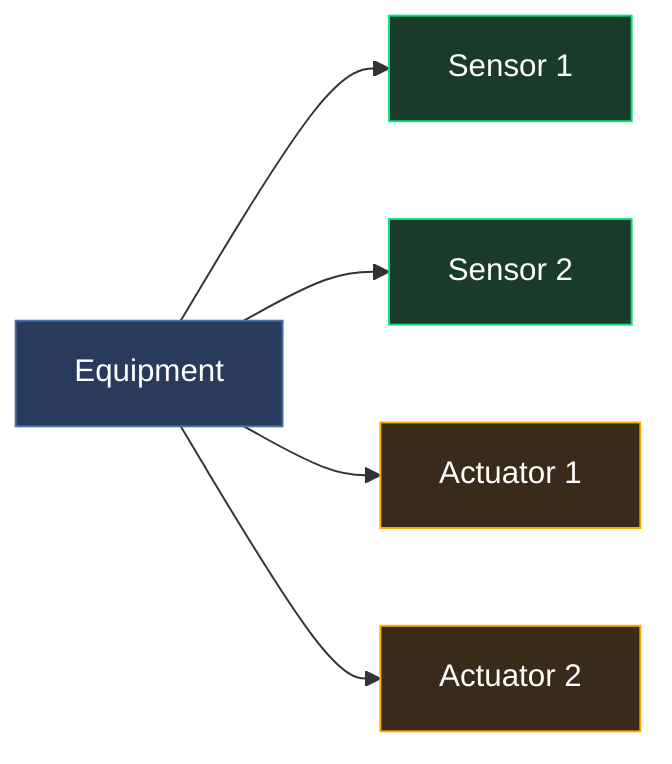
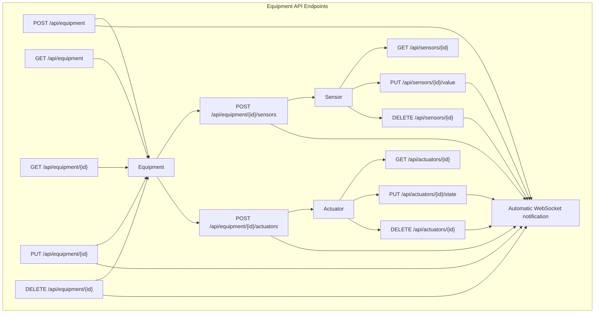

# Equipment API

CRUD operations for equipment, sensors, and actuators. All equipment state is in-memory and resets on server restart.

The shell examples below form one runnable sequence against a freshly started
server. They deliberately use separate IDs for the single-create, bulk-create,
and full-door examples so copying the document from top to bottom does not
create conflicts.





## Equipment

### Create Equipment

```
POST /api/equipment
```

```bash
curl -X POST http://localhost:9090/api/equipment \
  -H 'Content-Type: application/json' \
  -d '{
    "id": "temp-1",
    "name": "Room Temperature Sensor",
    "type": "temperature_sensor",
    "category": "monitoring",
    "level": "level0",
    "room": "1542",
    "status": "running"
  }'
```

```json
{
  "id": "temp-1",
  "name": "Room Temperature Sensor",
  "type": "temperature_sensor",
  "category": "monitoring",
  "level": "level0",
  "room": "1542",
  "status": "running",
  "version": 1,
  "sensors": [],
  "actuators": []
}
```

### Equipment Object

| Field | Type | Description |
|-------|------|-------------|
| `id` | string | Unique equipment ID |
| `name` | string | Display name |
| `type` | string | Equipment type (e.g. `door_lock`, `ac_unit`) |
| `category` | string | Category (e.g. `access_control`, `hvac`, `monitoring`) |
| `level` | string | Floor level: `level0`, `level1`, `level2` |
| `room` | string | Room name/label from the floor plan (e.g. `"1542"`, `"A2306"`) |
| `position` | `[x,y]` | Optional exact floor-plan coordinate; room-centre layout is used when omitted |
| `height` | number | Optional height above the local floor, from 0 to 100 |
| `heading` | number | Optional orientation in degrees, retained for oriented clients |
| `status` | string | `running`, `stopped`, `warning`, `alarm` |
| `version` | integer | Global equipment snapshot version assigned atomically to the mutation |
| `sensors` | array | Attached sensors |
| `actuators` | array | Attached actuators |

### Bulk Create Equipment

Create multiple equipment items with their sensors and actuators in a single request.

```
POST /api/equipment/bulk
```

```bash
curl -X POST http://localhost:9090/api/equipment/bulk \
  -H 'Content-Type: application/json' \
  -d '[
    {
      "id": "bulk-temp-1", "name": "Bulk Temp Sensor", "type": "temperature_sensor",
      "category": "monitoring", "level": "level0", "room": "1542", "status": "running",
      "sensors": [
        {"id": "bulk-temp-1-val", "name": "Temperature", "type": "temperature", "data_type": "text", "unit": "°C", "value": "21.5"}
      ],
      "actuators": []
    },
    {
      "id": "bulk-door-1", "name": "Bulk Door Lock", "type": "door_lock",
      "category": "access_control", "level": "level0", "room": "1542", "status": "running",
      "sensors": [
        {"id": "bulk-door-1-pos", "name": "Position", "type": "door_position", "data_type": "binary"}
      ],
      "actuators": [
        {"id": "bulk-door-1-lock", "name": "Lock", "type": "lock_control", "state": "locked"}
      ]
    }
  ]'
```

```json
{"created": 2, "skipped": 0, "total": 2, "version": 2}
```

Existing or repeated equipment IDs are skipped, making seed programs
idempotent. New sensor and actuator IDs must be globally unique within their
own resource type. A child conflict rejects the complete batch without
publishing a partial setup. Successful creation bumps the version and notifies
all browser sessions. The version above assumes the preceding single-create
example was the first mutation after startup; in a real run it is simply the
next global equipment version.

### List Equipment

```
GET /api/equipment
```

Optional query filters:

| Parameter | Description |
|-----------|-------------|
| `level` | Filter by floor (e.g. `level0`) |
| `room` | Filter by room name (e.g. `1542`) |
| `type` | Filter by equipment type (e.g. `smoke_detector`) |
| `category` | Filter by category (e.g. `monitoring`) |

```bash
# List all
curl http://localhost:9090/api/equipment

# Filter by floor and category
curl 'http://localhost:9090/api/equipment?level=level0&category=monitoring'
```

### Get Equipment

```
GET /api/equipment/{id}
```

```bash
curl http://localhost:9090/api/equipment/temp-1
```

### Update Equipment

```
PUT /api/equipment/{id}
```

```bash
curl -X PUT http://localhost:9090/api/equipment/temp-1 \
  -H 'Content-Type: application/json' \
  -d '{
    "name": "Room Temperature Sensor (Updated)",
    "type": "temperature_sensor",
    "category": "monitoring",
    "level": "level0",
    "room": "1542",
    "status": "warning"
  }'
```

### Delete Equipment

```
DELETE /api/equipment/{id}
```

```bash
# Create a disposable item so the later sensor examples can keep using temp-1.
curl -sS -X POST http://localhost:9090/api/equipment \
  -H 'Content-Type: application/json' \
  -d '{"id":"delete-me","name":"Disposable","type":"test","category":"monitoring","level":"level0","room":"1542","status":"stopped"}' >/dev/null
curl -X DELETE http://localhost:9090/api/equipment/delete-me
```

### Notify Equipment Change (legacy)

Every successful equipment, sensor, or actuator mutation already bumps the
global equipment version and notifies connected browser sessions. This endpoint
is retained for older clients that mutate an out-of-band data source; normal
clients do not need it.

Mutation responses also expose the current version in the
`X-BuildSim-Version` response header. Sensor and actuator value responses include
the same version in their JSON body.

```
POST /api/equipment/notify
```

```bash
curl -X POST http://localhost:9090/api/equipment/notify
```

```json
{"version": 6}
```

The numeric value depends on earlier mutations; it is shown only to illustrate
the response shape.

---

## Sensors

Sensors are data points attached to equipment. Each sensor has a value that can be text or binary.

### Add Sensor

```
POST /api/equipment/{equipment_id}/sensors
```

```bash
# Create the second parent used by the binary-sensor and actuator examples.
curl -sS -X POST http://localhost:9090/api/equipment \
  -H 'Content-Type: application/json' \
  -d '{"id":"door-1","name":"Door 1","type":"door_lock","category":"access_control","level":"level0","room":"1542","status":"running"}' >/dev/null

# Text sensor (temperature)
curl -X POST http://localhost:9090/api/equipment/temp-1/sensors \
  -H 'Content-Type: application/json' \
  -d '{
    "id": "temp-1-reading",
    "name": "Temperature",
    "type": "temperature",
    "data_type": "text",
    "unit": "°C",
    "value": "21.5"
  }'

# Binary sensor (door position)
curl -X POST http://localhost:9090/api/equipment/door-1/sensors \
  -H 'Content-Type: application/json' \
  -d '{
    "id": "door-1-pos",
    "name": "Door Position",
    "type": "door_position",
    "data_type": "binary",
    "unit": ""
  }'
```

### Sensor Object

| Field | Type | Description |
|-------|------|-------------|
| `id` | string | Unique sensor ID |
| `name` | string | Display name |
| `type` | string | Sensor type (e.g. `temperature`, `door_position`, `smoke_level`) |
| `data_type` | string | `"text"` or `"binary"` |
| `value` | string | Current text value (when data_type is text) |
| `binary_value` | bool | Current binary value (when data_type is binary) |
| `unit` | string | Unit of measurement (e.g. `"°C"`, `"ppm"`, `"lux"`) |
| `timestamp` | string | ISO 8601 timestamp of last update |

### List Sensors

```
GET /api/equipment/{equipment_id}/sensors
```

```bash
curl http://localhost:9090/api/equipment/temp-1/sensors
```

### Get Sensor

```
GET /api/sensors/{sensor_id}
```

```bash
curl http://localhost:9090/api/sensors/temp-1-reading
```

### Set Sensor Value

```
PUT /api/sensors/{sensor_id}/value
```

```bash
# Set text value
curl -X PUT http://localhost:9090/api/sensors/temp-1-reading/value \
  -H 'Content-Type: application/json' \
  -d '{"data_type": "text", "value": "23.7"}'

# Set binary value
curl -X PUT http://localhost:9090/api/sensors/door-1-pos/value \
  -H 'Content-Type: application/json' \
  -d '{"data_type": "binary", "binary_value": true}'
```

### Delete Sensor

```
DELETE /api/sensors/{sensor_id}
```

```bash
curl -X DELETE http://localhost:9090/api/sensors/temp-1-reading
```

---

## Actuators

Actuators are control points attached to equipment.

### Add Actuator

```
POST /api/equipment/{equipment_id}/actuators
```

```bash
curl -X POST http://localhost:9090/api/equipment/door-1/actuators \
  -H 'Content-Type: application/json' \
  -d '{
    "id": "door-1-lock",
    "name": "Lock Control",
    "type": "lock_control",
    "state": "locked"
  }'
```

### Actuator Object

| Field | Type | Description |
|-------|------|-------------|
| `id` | string | Unique actuator ID |
| `name` | string | Display name |
| `type` | string | Actuator type (e.g. `lock_control`, `fan_speed`, `on_off`) |
| `state` | string | Current state value |
| `timestamp` | string | ISO 8601 timestamp of last update |

### List Actuators

```
GET /api/equipment/{equipment_id}/actuators
```

```bash
curl http://localhost:9090/api/equipment/door-1/actuators
```

### Get Actuator

```
GET /api/actuators/{actuator_id}
```

```bash
curl http://localhost:9090/api/actuators/door-1-lock
```

### Set Actuator State

```
PUT /api/actuators/{actuator_id}/state
```

```bash
curl -X PUT http://localhost:9090/api/actuators/door-1-lock/state \
  -H 'Content-Type: application/json' \
  -d '{"state": "unlocked"}'
```

### Delete Actuator

```
DELETE /api/actuators/{actuator_id}
```

```bash
curl -X DELETE http://localhost:9090/api/actuators/door-1-lock
```

---

## Full Example: Door with Sensors and Actuators

```bash
BASE=localhost:9090

# Create equipment
curl -X POST http://$BASE/api/equipment -H 'Content-Type: application/json' -d '{
  "id": "door-main", "name": "Main Entrance", "type": "door_lock",
  "category": "access_control", "level": "level0", "room": "1542", "status": "running"
}'

# Add sensors
curl -X POST http://$BASE/api/equipment/door-main/sensors -H 'Content-Type: application/json' \
  -d '{"id": "door-main-pos", "name": "Position", "type": "door_position", "data_type": "binary"}'

curl -X POST http://$BASE/api/equipment/door-main/sensors -H 'Content-Type: application/json' \
  -d '{"id": "door-main-lock-st", "name": "Lock Status", "type": "lock_status", "data_type": "binary"}'

# Add actuator
curl -X POST http://$BASE/api/equipment/door-main/actuators -H 'Content-Type: application/json' \
  -d '{"id": "door-main-lock", "name": "Lock", "type": "lock_control", "state": "locked"}'

# Open door and unlock
curl -X PUT http://$BASE/api/sensors/door-main-pos/value \
  -H 'Content-Type: application/json' -d '{"data_type": "binary", "binary_value": true}'
curl -X PUT http://$BASE/api/actuators/door-main-lock/state \
  -H 'Content-Type: application/json' -d '{"state": "unlocked"}'

# The successful writes above notify connected browsers automatically.
```
