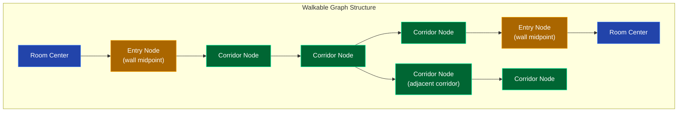
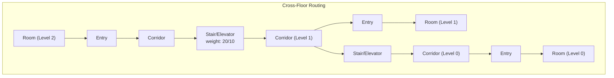

# Navigation Graph API

Query the building navigation graph and compute shortest paths using Dijkstra's algorithm.





Two graph types are available:

- **Adjacency graph** (`type=adjacency`, default) -- Room-to-corridor logical connections
- **Walkable graph** (`type=walkable`) -- Corridor centerline nodes with room entry points at wall midpoints. Paths follow corridors through doorways.

Walkable routes apply the current semantic door snapshot. An entry linked to a
locked, jammed, or blocked door is excluded; a closed but unlocked door remains
available. See [Entrances, doors, and locks](doors.md).

## Get Navigation Graph

```
GET /api/graph
```

| Parameter | Type | Default | Description |
|-----------|------|---------|-------------|
| `level` | query | `level0` | Floor level |
| `type` | query | `adjacency` | Graph type: `adjacency` or `walkable` |

```bash
# Walkable graph for level0 (matches the excerpt below)
curl 'http://localhost:9090/api/graph?level=level0&type=walkable'

# Adjacency graph for level1 (the default graph type)
curl 'http://localhost:9090/api/graph?level=level1'
```

```json
{
  "nodes": [
    {"id": 0, "name": "1540", "x": 17.33, "y": 177.58, "type": "corridor"},
    {"id": 1, "name": "1540", "x": 17.33, "y": 182.58, "type": "corridor"}
  ],
  "edges": [
    {"from": 0, "to": 1, "weight": 5, "x1": 17.33, "y1": 177.58, "x2": 17.33, "y2": 182.58}
  ]
}
```

Only the first two nodes and first edge are shown; the endpoint returns the
complete graph as valid JSON.

### Node Types (walkable graph)

| Type | Description |
|------|-------------|
| `corridor` | Node along corridor centerline |
| `entry` | Room entry point at wall midpoint (doorway) |
| `room` | Room center node |

### Edge Object

| Field | Type | Description |
|-------|------|-------------|
| `from` | int | Source node ID |
| `to` | int | Target node ID |
| `weight` | float | Edge distance |
| `x1, y1` | float | Source point coordinates (optional) |
| `x2, y2` | float | Target point coordinates (optional) |

---

## Compute Shortest Path

```
GET /api/graph/route
```

### By Room Name (recommended for walkable graph)

| Parameter | Type | Description |
|-----------|------|-------------|
| `from_name` | query | Source room name (e.g. `A2306`) |
| `to_name` | query | Target room name (e.g. `1542`) |
| `level` | query | Floor level (omit for cross-floor routing) |
| `from_level` | query | Source floor for a cross-floor route |
| `to_level` | query | Destination floor for a cross-floor route |
| `type` | query | Graph type: `adjacency` or `walkable` |

```bash
# Same-floor route
curl 'http://localhost:9090/api/graph/route?from_name=1542&to_name=A1123&level=level0&type=walkable'

# Cross-floor route: omit level, qualify both endpoints
curl 'http://localhost:9090/api/graph/route?from_name=A2306&from_level=level1&to_name=A109&to_level=level0&type=walkable'
```

This is an abridged cross-floor result from the command above:

```jsonc
{
  "path": [
    {"room_id": 1638, "name": "A2306", "level": "level1", "x": 111.99, "y": 55.77},
    {"room_id": 1637, "name": "A2306", "level": "level1", "x": 117.79, "y": 55.77},
    // ... 85 intermediate waypoints
    {"room_id": 524, "name": "A109", "level": "level0", "x": 278.72, "y": 261.33},
    {"room_id": 525, "name": "A109", "level": "level0", "x": 264.3, "y": 249.43}
  ],
  "distance": 516.7
}
```

### By Node ID

| Parameter | Type | Description |
|-----------|------|-------------|
| `from` | query | Source node ID (integer) |
| `to` | query | Target node ID (integer) |
| `level` | query | Floor level |
| `type` | query | Graph type |

```bash
curl 'http://localhost:9090/api/graph/route?from=0&to=5&level=level0'
```

---

## Cross-Floor Routing

When using the walkable graph with room names and no `level` parameter, the server uses a merged multi-floor graph that includes stair and elevator connections. Always send `from_level` and `to_level` in new clients. If a name occurs on multiple floors and its qualifier is omitted, the API returns `400 Bad Request` instead of silently selecting the wrong room. A missing endpoint or disconnected path returns `404 Not Found`.

```bash
# Route from level1 to level0 (via stairs)
curl 'http://localhost:9090/api/graph/route?from_name=A2306&from_level=level1&to_name=A109&to_level=level0&type=walkable'
```

The path will include nodes from both floors. Each node has a `level` field indicating which floor it's on. Cross-floor edges use stairs (weight 20) or elevators (weight 10).

---

## Examples

### Inspect the room nodes in a walkable graph

```bash
# Get walkable graph
curl -s 'http://localhost:9090/api/graph?level=level0&type=walkable' | python3 -c "
import sys, json
g = json.load(sys.stdin)
print(f'{len(g[\"nodes\"])} nodes, {len(g[\"edges\"])} edges')
rooms = [n for n in g['nodes'] if n.get('type') == 'room']
print(f'{len(rooms)} rooms connected')
for r in rooms[:10]:
    print(f'  {r[\"name\"]} at ({r[\"x\"]}, {r[\"y\"]})')
"
```

### Compute route and display distance

```bash
curl -s 'http://localhost:9090/api/graph/route?from_name=1542&to_name=A1123&level=level0&type=walkable' | python3 -c "
import sys, json
r = json.load(sys.stdin)
print(f'Route: {r[\"path\"][0][\"name\"]} -> {r[\"path\"][-1][\"name\"]}')
print(f'Distance: {r[\"distance\"]:.1f} units')
print(f'Waypoints: {len(r[\"path\"])}')
for n in r['path']:
    print(f'  {n[\"name\"]:10s} ({n[\"x\"]:6.1f}, {n[\"y\"]:6.1f})')
"
```
