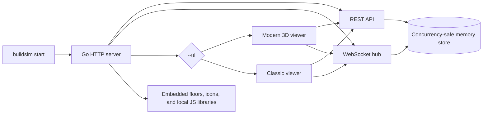
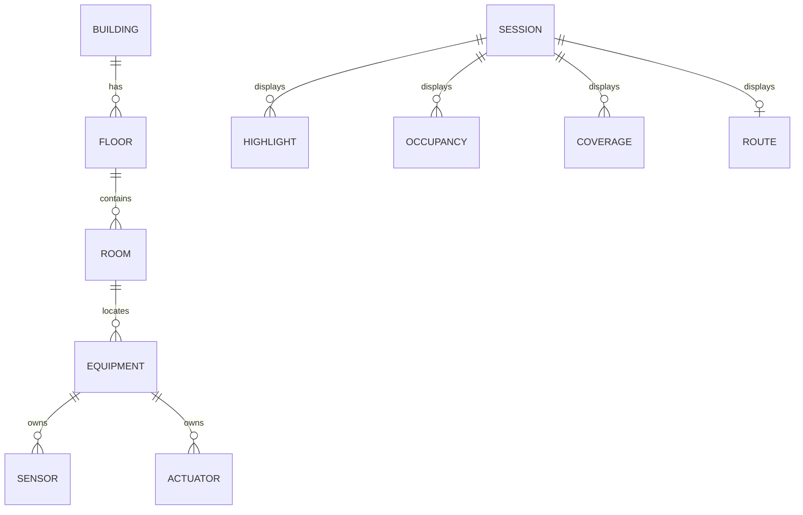
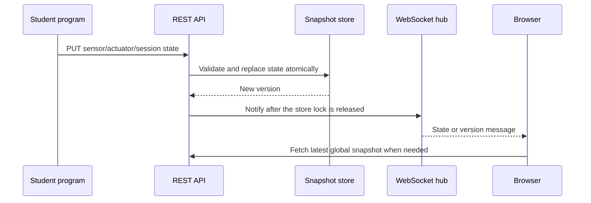

# Architecture

BuildSim is one self-contained Go process. Both browser interfaces are static
assets embedded into the same executable and call the same REST and WebSocket
backend.

The default listener is `127.0.0.1:9090`. There is no account service,
authentication, database, or external runtime dependency.

## Data ownership

Floor plans and browser assets are embedded and read-only in a release binary.
Equipment, readings, actuator states, occupancy, coverage, and sessions live in
memory. With `--edit`, a floor edit updates the in-memory snapshot. With both
`--edit` and `--edit-output`, it is also written atomically to a separate export
directory.

Room occupancy is keyed by `<level>/<room-name>`. The floor component avoids
collisions because both room names and numeric IDs may repeat across floors.

## Mutation and viewer flow

Store reads return deep copies. Handlers therefore serialize stable snapshots
after locks are released, and callers cannot mutate internal state. Nested
sensor and actuator IDs are indexed across bulk creation, updates, and deletes.
Bulk equipment creation validates the whole batch before publishing it.

When a WebSocket connects, the hub queues the current session snapshot before
allowing later broadcasts through. This prevents the viewer from missing state
set immediately before it connected.

## Source layout

| Path | Purpose |
|---|---|
| `cmd/` | CLI and modern-viewer source assembler |
| `pkg/model/` | JSON data types |
| `pkg/store/` | synchronized snapshot store |
| `pkg/server/` | router, validation, handlers, WebSocket hub |
| `pkg/graph/` | single- and multi-floor shortest paths |
| `pkg/client/` | small standard-library Go client |
| `data/` | embedded floor plans and SVG icons |
| `web/index.html` | classic viewer |
| `web/modern/src/` | maintainable modern viewer source fragments |
| `web/modern/index.html` | generated modern viewer |
| `web/vendor/` | locally served browser libraries |

Run `go generate ./...` after changing modern viewer fragments.
